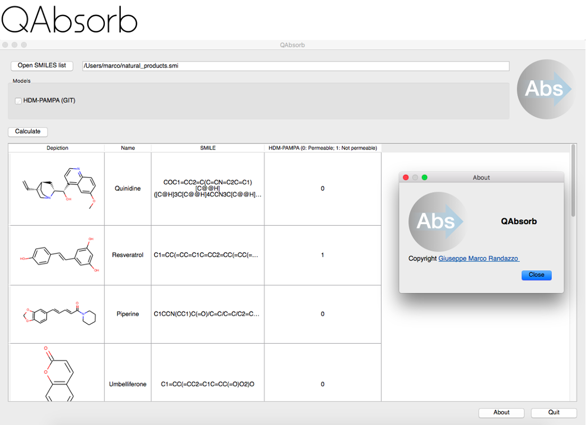

# QAbsorb: in silico software to predict passive permeability of natural products

QAbsorb is a software designed to help scientist in the prediction of natural product passive permeability.
The software is writen in python language and the graphic interface is developed in PyQt5.
Starting from the RDKit molecular descriptors, scikit-learn statistical engine and natural producs databases,
QAbsorb actually is able to predict:

- Gastrointestinal passive permeability (PAMPA-HMD model) [1]

References:
-----------
[1] QAbsorb: a reliable chemoinformatic tool for in silico prediction of passive intestinal permeability of Natural Products  based on PAMPA permeability assay (in preparation)

License
=======
QAbsorb was developped by Giuseppe Marco Randazzo, PhD and is distributed under license GPLv3.

However the natural products database is properto of the
[Phytochemistry and Bioactive Natural products group](http://www.unige.ch/sciences/pharm/fasie/index.html)
part of the [University of Geneva](https://epgl.unige.ch/epgl/index.php).

How to use QAbsorb?
===================

- Windows: Dowload the executable at ...
- MacOSX: Download the executable at ... or install from source
- Linux: Install from source

Install from source
===================

Requrements:
- Python >= 3.x.x
- PyQt5
- RDKit
- Scikit-Learn >= 18.x

