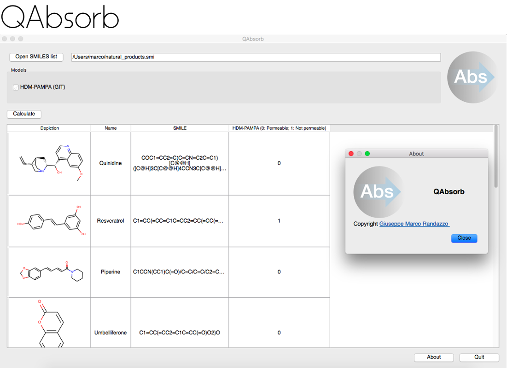

# QAbsorb: in silico software to predict passive permeability of natural products

QAbsorb is a software designed to help scientist in the prediction of natural product passive permeability.
The software is writen in python language and the graphic interface is developed in PyQt5.
Starting from the RDKit molecular descriptors, scikit-learn statistical engine and natural producs databases,
QAbsorb actually is able to predict:

- Gastrointestinal passive permeability (PAMPA-HMD model) [1]

References:
-----------
[1] QAbsorb: a reliable chemoinformatic tool for in silico prediction of passive intestinal permeability of Natural Products  based on PAMPA permeability assay (in preparation)

License
=======
QAbsorb was developped by Giuseppe Marco Randazzo, PhD and is distributed under license GPLv3.

However the natural products database is properto of the
[Phytochemistry and Bioactive Natural products group](http://www.unige.ch/sciences/pharm/fasie/index.html)
part of the [University of Geneva](https://epgl.unige.ch/epgl/index.php).

Install from source
===================

Requrements:
- Python >= 3.x.x
- PyQt5
- RDKit
- Scikit-Learn >= 18.x

pip install jsonpickle
pip install PyQt5
pip install scikit-learn

install rdkit with python support (i.e. homebrew osx: brew install rdkit; fedora: dnf install rdkit-python; window use [Anaconda](https://docs.continuum.io/anaconda/install.html) ) 

git clone https://github.com/gmrandazzo/QAbsorb.git
python QAbsorb/src/main.py
Good luck!

<!--
Create OSX DMG installer
===================

- Install locally RDKit
- Go to "src" directory:
- pip3 install virtualenv
- virtualenv venv
- . venv/bin/activate
- pip install py2app
- pip install pyqt5
- pip install scikit-learn
- pip install matplotlib
- pip install scipy
- copy rdkit sites packages to the virtual environment: cp -r /usr/local/Cellar/rdkit/2017.03.3/lib/python3.6/site-packages/rdkit venv/lib/python3.6/site-packages/
- Run python setup.py py2app -q
- search in ../dist if a QAbsorb.app was created
- deactivate
- npm install -g appdmg
- appdmg spec.json resources/QAbsorb-OSX-x86_64.dmg

Done!

-->

